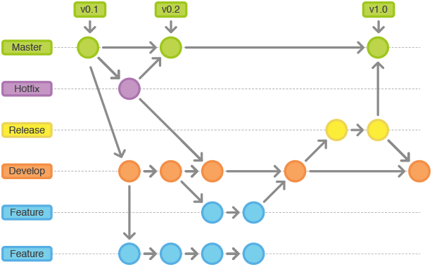
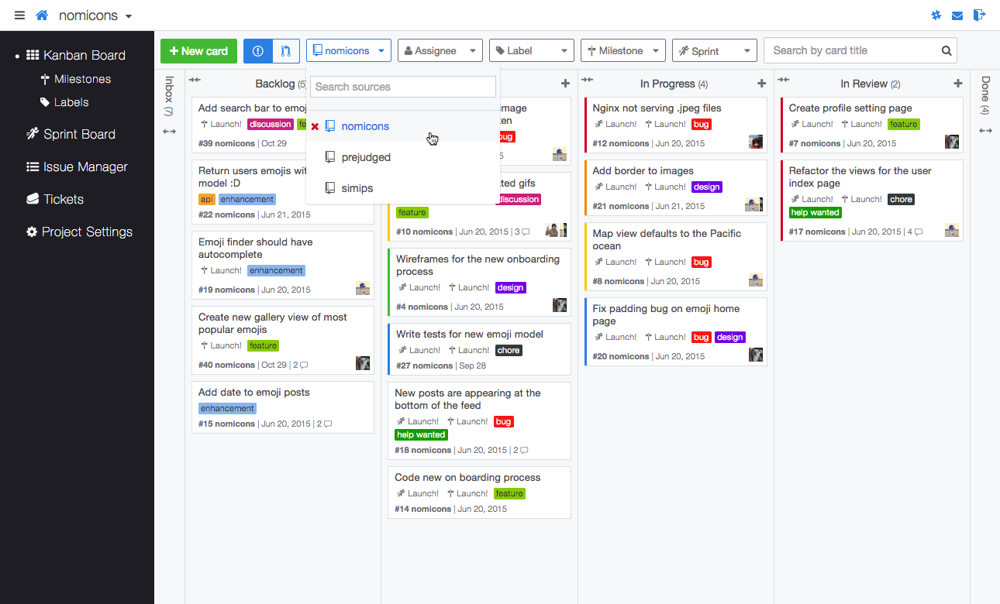

# Что такое Github

Это веб-платформа для хостинга и совместной разработки программного обеспечения с использованием системы контроля версий Git. Здесь несколько ключевых аспектов, которые определяют GitHub:

1. **[Хостинг](https://ru.wikipedia.org/wiki/%D0%A5%D0%BE%D1%81%D1%82%D0%B8%D0%BD%D0%B3) репозиториев:** GitHub предоставляет место для хранения ваших Git-репозиториев. [Репозиторий](https://ru.wikipedia.org/wiki/%D0%A0%D0%B5%D0%BF%D0%BE%D0%B7%D0%B8%D1%82%D0%BE%D1%80%D0%B8%D0%B9) — это место, где вы храните свой код, и GitHub обеспечивает удаленный доступ к нему.

   
2. **Система контроля версий Git:** это распределенная система управления версиями, которая позволяет отслеживать изменения в коде, возвращаться к предыдущим версиям, а также совмещать изменения от нескольких человек. GitHub предоставляет интерфейс для работы с Git и облегчает коллективную разработку.

   
3. **Коллаборация и Pull Requests:** GitHub упрощает процесс совместной разработки. Вы можете создавать форки (копии) чужих репозиториев, вносить изменения и предлагать их обратно через механизм Pull Requests. Это позволяет участникам проекта обсуждать изменения, проверять их и внедрять в проект.

   
4. **Инструменты для управления проектами:** GitHub предоставляет различные инструменты для управления проектами, такие как задачи (Issues), доски (Projects), обсуждения и так далее. Эти инструменты помогают в организации работы и обсуждении ваших проектов.

   
5. **GitHub Pages:** Это сервис GitHub, который позволяет публиковать веб-сайты прямо из репозиториев. Вы можете использовать его для создания сайтов для ваших проектов, документации и т.д.

   
6. **Социальные аспекты:** GitHub также является социальной платформой для разработчиков. Вы можете следить за активностью других разработчиков, отмечать звездами (star) интересные вам проекты, форкать их и так далее.

   

GitHub широко используется в мире разработки программного обеспечения и стал неотъемлемой частью открытого и закрытого программного обеспечения. Он предоставляет инструменты, которые делают процесс разработки более эффективным и удобным для команд разработчиков.
