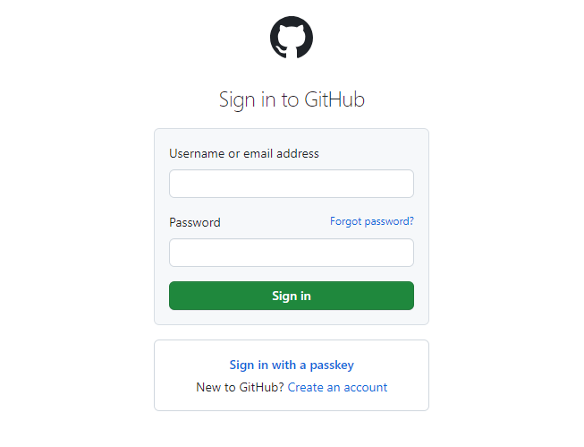
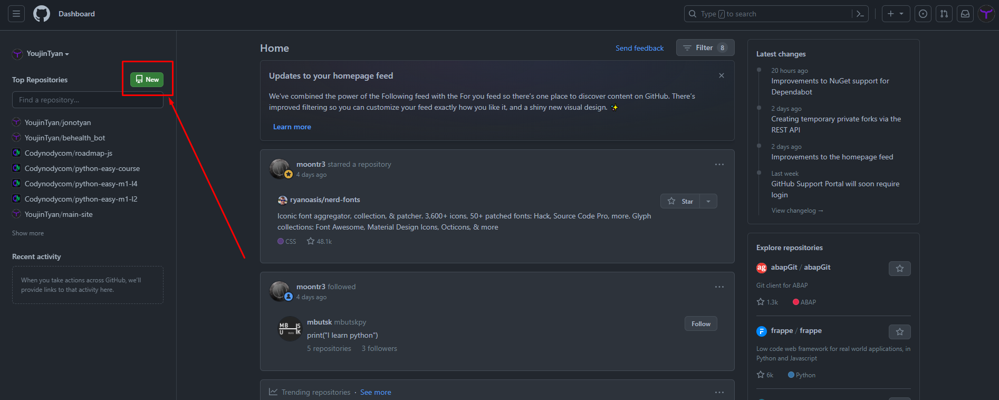
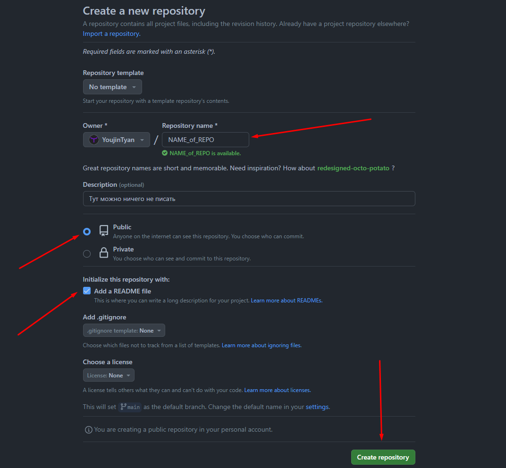

s

# Как опубликовать репозиторий

1. **Создайте учетную запись на GitHub:**

   * Перейдите на [официальный сайт GitHub](https://github.com/).
   * Нажмите на кнопку "Sign up" и следуйте инструкциям для создания учетной записи.


2. **Войдите в свой аккаунт:**

* После создания аккаунта войдите в него на [странице входа](https://github.com/login).



3. **Создайте новый репозиторий:**

* На вашей домашней странице GitHub нажмите кнопку "New" (сверху слева).
* Введите имя репозитория, описание и выберите опции по умолчанию.
* Вы можете добавить README файл (это хорошая практика) и выбрать лицензию.
* Нажмите кнопку "Create repository".





4. **Инициализируйте локальный репозиторий (если у вас его еще нет):**

* Скачайте Git с [официальной страницы](https://git-scm.com/download/win) и установите его.
* Откройте терминал или командную строку.
* Перейдите в каталог(папку), где хотите создать свой проект.
* Выполните команды:

```
git init
git add .
git commit -m "Первый коммит"
```

**5. Свяжите локальный репозиторий с удаленным (GitHub):**

* Скопируйте URL вашего нового репозитория на GitHub.
* В терминале выполните команду:

```
git remote add origin ВАШ_URL
```

* Замените `ВАШ_URL` на фактический URL вашего репозитория.

6. **Отправьте изменения на GitHub:**

* Выполните команду:

```
git push -u origin master
```

Эта команда отправит ваш код на GitHub.

Теперь ваш репозиторий опубликован на GitHub. Вы можете продолжить работу над проектом, создавать новые ветки, добавлять файлы и использовать другие функции Git и GitHub для управления вашим кодом.
